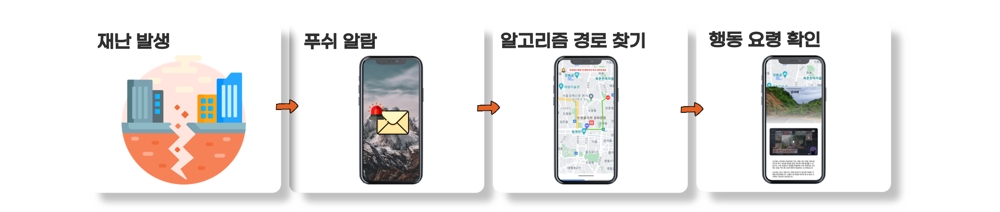
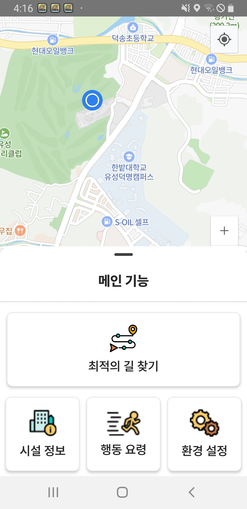
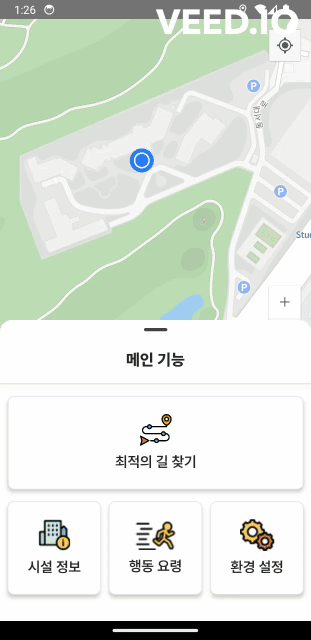
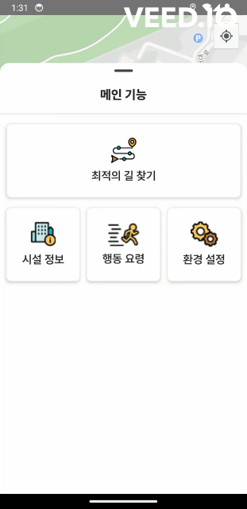
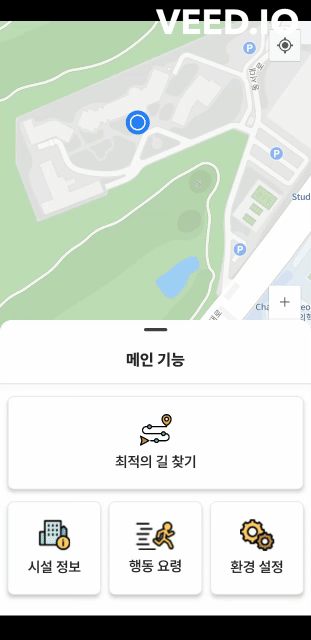

> 모두가 안전하게, 튀소

---


---

### 💎프로젝트 진행기간

2024.02.19(월) ~ 2024.04.05(금)

<br>

---

### 🎬[소개영상 보기](https://youtu.be/0UaigaNUpOE)

---

### 🏅 프로젝트 소개

```
'튀소'는 '튀다' + '하소' 를 합친 용어로
재난 발생시 빠르게 대피소를 안내해주는 서비스입니다.
```

<br>

---

### 🔎 프로젝트 개요

> 튀소 - 빅데이터 분산을 통한 재난대피 경로 안내



- 긴급, 위급 재난 발생시 사용자에게 푸시 알람
- 현재 위치에서 가까운 대피소까지 최적의 경로 제공
- 각 재난상황에 맞는 행동 요령

<br>

---

### 🚩 프로젝트 기술 설명

- 크롤링 및 openAI를 이용한 재난 문자 분석
- 지도 경로 데이터 이진화를 통한 대피소와의 전체경로 분산 처리
- Dijkstrat, A\* 알고리즘을 이용한 길 찾기 서비스
- 재난 발생 시 사용자에게 긴급 푸쉬 알람 서비스

### 기술스택

#### 개발 환경

 


#### 개발

##### BackEnd & Database

 
 
 


##### FrontEnd

 


#### CI/CD

 


#### 협업 툴

 
 
 

---

### 백엔드 디렉토리 구조

```sh
📦backend
 ┣ 📂api
 ┃ ┣ 📜emergency.py
 ┃ ┣ 📜message.py
 ┃ ┣ 📜path.py
 ┃ ┣ 📜shelter.py
 ┃ ┣ 📜tips.py
 ┃ ┗ 📜__init__.py
 ┣ 📂database
 ┃ ┣ 📜emergencydb.py
 ┃ ┣ 📜mapdb.py
 ┃ ┣ 📜mongo.py
 ┃ ┣ 📜pathdb.py
 ┃ ┗ 📜__init__.py
 ┣ 📂repository
 ┃ ┣ 📜odm.py
 ┃ ┣ 📜path.py
 ┃ ┣ 📜shelter.py
 ┃ ┣ 📜tips.py
 ┃ ┗ 📜__init__.py
 ┣ 📂resource
 ┃ ┣ 📜binary_map.pkl
 ┃ ┣ 📜binary_map.zip
 ┃ ┣ 📜gps_mapping.pkl
 ┃ ┣ 📜gps_mapping.zip
 ┃ ┣ 📜logo.py
 ┃ ┗ 📜__init__.py
 ┣ 📂schema
 ┃ ┣ 📜request.py
 ┃ ┣ 📜response.py
 ┃ ┗ 📜__init__.py
 ┣ 📂service
 ┃ ┣ 📜emergency.py
 ┃ ┣ 📜path.py
 ┃ ┣ 📜shelter.py
 ┃ ┣ 📜tips.py
 ┃ ┗ 📜__init__.py
 ┣ 📂util
 ┃ ┣ 📜algo.py
 ┃ ┣ 📜fcm_push.py
 ┃ ┣ 📜gpt_location.py
 ┃ ┣ 📜map.py
 ┃ ┣ 📜message_10sec_auto.py
 ┃ ┣ 📜naver_geocoding.py
 ┃ ┣ 📜tiso-d135c-firebase-adminsdk-util1-47189378e4.json
 ┃ ┗ 📜__init__.py
 ┗ 📜main.py
```

### 프론트 디렉토리 구조

```sh
📦src
 ┣ 📂api
 ┃ ┣ 📜medical.js
 ┃ ┣ 📜path.js
 ┃ ┣ 📜shelter.js
 ┃ ┗ 📜tip.js
 ┣ 📂pages
 ┃ ┣ 📂Bottomsheet
 ┃ ┃ ┣ 📂FacilitiesInfo
 ┃ ┃ ┃ ┣ 📜categorySearch.jsx
 ┃ ┃ ┃ ┣ 📜FacilitiesInfoMain.jsx
 ┃ ┃ ┃ ┣ 📜HospitalInfoDetail.jsx
 ┃ ┃ ┃ ┣ 📜PharmacyInfoDetail.jsx
 ┃ ┃ ┃ ┣ 📜ShelterCategory.jsx
 ┃ ┃ ┃ ┗ 📜ShelterInfoDetail.jsx
 ┃ ┃ ┣ 📂SafetyGuideline
 ┃ ┃ ┃ ┣ 📂SafetyCategory
 ┃ ┃ ┃ ┃ ┣ 📜EmergencyEvacuation.jsx
 ┃ ┃ ┃ ┃ ┣ 📜LifeSafety.jsx
 ┃ ┃ ┃ ┃ ┣ 📜NaturalDisaster.jsx
 ┃ ┃ ┃ ┃ ┗ 📜SocialDisaster.jsx
 ┃ ┃ ┃ ┣ 📜SafetyGuidelineDetail.jsx
 ┃ ┃ ┃ ┗ 📜SafetyGuidelineMain.jsx
 ┃ ┃ ┣ 📂SystemSetting
 ┃ ┃ ┃ ┣ 📂MessageTypeSettings
 ┃ ┃ ┃ ┃ ┗ 📜MessageTypeSettings.jsx
 ┃ ┃ ┃ ┣ 📂RegionalSettings
 ┃ ┃ ┃ ┃ ┣ 📜Modal.jsx
 ┃ ┃ ┃ ┃ ┣ 📜RegionalAdd.jsx
 ┃ ┃ ┃ ┃ ┗ 📜RegionalSettings.jsx
 ┃ ┃ ┃ ┗ 📜SystemSettingMain.jsx
 ┃ ┃ ┗ 📜CitiesContext.jsx
 ┃ ┣ 📜BottomSheet.jsx
 ┃ ┣ 📜EmergencyModal.jsx
 ┃ ┣ 📜HospitalInfoModal.jsx
 ┃ ┣ 📜Loading.jsx
 ┃ ┣ 📜MainLoading.jsx
 ┃ ┣ 📜Map.jsx
 ┃ ┣ 📜PharmacyInfoModal.jsx
 ┃ ┗ 📜ShelterInfoModal.jsx
 ┣ 📂state
 ┃ ┣ 📜atoms.jsx
 ┃ ┗ 📜selectedAtom.jsx
 ┗ 📂util
 ┃ ┗ 📜http-commons.js
```

---

### 주요 기능

#### 재난 문자 분석 및 앱 푸시

- **재난문자**: 비상 시 빠른 대피 안내를 위해서 재난문자 푸쉬 알람이 발송됩니다.
- **긴급대피 알람**: 비상 대피 기간동안에는 앱 상단에 긴급대피 알림이 켜져있게 됩니다.

#### 비상 시 최적 경로 안내

- **최적의 길 찾기**: 현재 위치에서 A\*알고리즘을 이용해 가장 가깝고 안전한 대피소까지의 길을 빠르게 안내해줍니다. 재난 상황 중 통행 금지 지역이 생길 경우 우회하여 안내해줍니다.

#### 평상 시 경로 안내

- **대피소 길 찾기** : 현재 위치에서 다익스트라 알고리즘을 이용해 도보 위주의 대피소 경로를 안내해줍니다.

#### 시설정보

- **대피소 정보**: 민방위 대피소, 지진 옥외 대피소, 무더위 쉼터에 대한 정보가 현재 위치에서 가까운 순으로 리스트로 보여주며, 길안내를 제공해줍니다.
- **병원 정보**: 병원 정보가 현재 위치에서 가까운 순으로 리스트로 보여주며, 길 안내를 제공해줍니다.
- **약국 정보**: 약국 정보가 현재 위치에서 가까운 순으로 리스트로 보여주며, 길 안내를 제공해줍니다.

#### 행동요령

- **재난 별 카테고리**: 자연 재난, 사회 재난, 생활 안전, 비상 대피의 행동요령을 펭수 영상과 함께 숙지해보세요.

#### 환경설정

- **수신 유형 설정**: 긴급, 안전 재난 문자 푸쉬 알림을 켜고, 끌 수 있습니다.
- **수신 지역 설정**: 재난 알림 수신 지역을 추가할 수 있습니다.

<br>

---

<br>

### 프로젝트 산출물

- [기능명세서](https://saber-circle-3a4.notion.site/9e9e996a08e849cb90723452cd8e7bcc)
- [시스템 아키텍처](docs/프로젝트%20산출물/시스템아키텍처.md)
- [와이어프레임](https://www.figma.com/file/0DDjCyLNKywBB8fPEVG39c/%ED%8A%B9%ED%99%94B308-WireFrame?type=design&node-id=0%3A1&mode=design&t=2iTlIruGBPeeCLg3-1)
- [ERD](https://www.erdcloud.com/d/XtfXjLhRTTZepzt8H)
- [API 명세서](https://saber-circle-3a4.notion.site/API-6c8bdfa3cea44cffb5eed5cb6f8f8609)
- [BE 코드 컨벤션](https://saber-circle-3a4.notion.site/40829d09e2984b8cb94912d91beba8f6)
- [FE 코드 컨벤션](https://saber-circle-3a4.notion.site/40829d09e2984b8cb94912d91beba8f6)

<br>

---

<br>

### 프로젝트 결과물

- [중간 발표자료](docs/프로젝트%20결과물/기획발표자료.md)
- [최종 발표자료](docs/프로젝트%20결과물/최종발표자료.md)

<br>

---

<br>

### 팀원 소개

### Contributors

<table style="width: 100%; text-align: center;">
  <tr>
    <td style="text-align: center;"><br><strong>서보현</strong><br>🍪Back-end<br>💎Team Leader</td>
    <td style="text-align: center;"><br><strong>최재식</strong><br>💟Back-end</td>
    <td style="text-align: center;"><br><strong>서정현</strong><br>🧗‍♂️Back-end<br>🤴Back-end Leader</td>
  </tr>
  <tr>
    <td style="text-align: center;"><br><strong>이재문</strong><br>🍖Front-end<br></td>
    <td style="text-align: center;"><br><strong>차준석</strong><br>🌹Front-end<br>👸Front-end Leader</td>
    <td style="text-align: center;"><br><strong>강대은</strong><br>🍞Front-end</td>
  </tr>
</table>

<br>

---

<br>

## 튀소 서비스 화면

### 메인



### 긴급 재난 알림


### 긴급상황 대피소 길찾기


### 대피소, 병원, 약국 조회


### 시설 정보 조회 및 길찾기


### 행동요령



### 환경설정



### 지역설정


