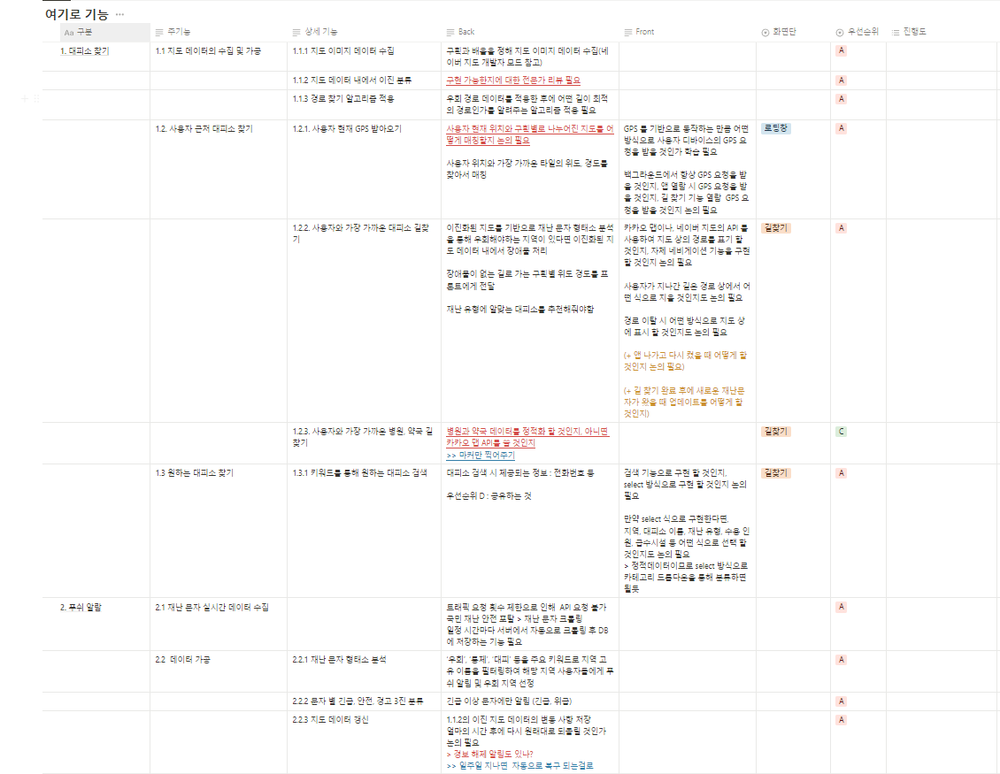
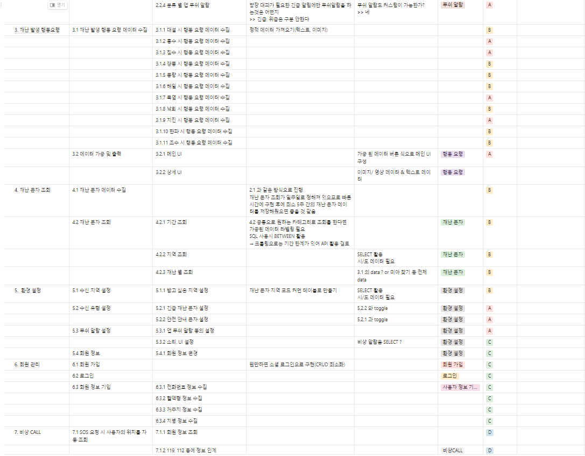
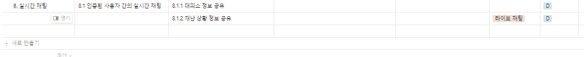
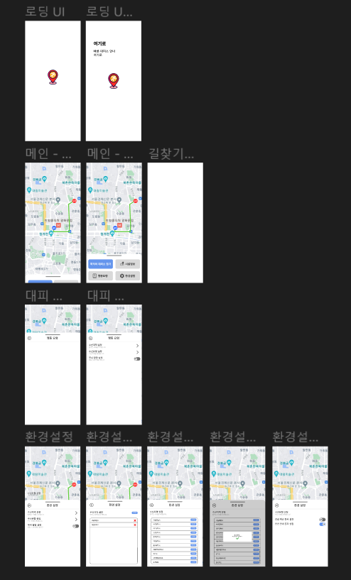

# 240227 화

> ### 오늘 한일
>
> - react 기초 학습
> - react-native 기초 학습
> - 아이디어 고도화
>   - dataset 자료 수집
>   - GPS 기반 네비게이션 기능 자료 조사
> - 기능 명세서 초안 작성
>   - [기능 명세서](https://www.notion.so/9e9e996a08e849cb90723452cd8e7bcc)

> ### 오늘 배운 것
>
> - 리액트 기본 개념
> - 변수와 상수의 차이
> - JavaScript 콜백함수 심화
>   - 콜백 함수의 정확한 동작 이해
>   - 콜백 함수 응용 사례 실습
> - JavaScript 함수 표현식, 화살표 함수 심화
>   - 화살표 함수 응용 사례 실습
> - 배열 내장 함수
>   - 배열 내장 함수 암기

> ### 발전 과제
>
> - 지도 데이터 수집하기
> - 이미지 전처리 기술 학습
> - 다엑스트라 알고리즘 추가 학습

# 240228 수

> ### 오늘 한일
>
> - react-native 기초 학습
> - 아이디어 고도화
>   - dataset 자료 수집(네이버 맵 URL로 가능성 확인)
>   - 상세 기능 회의(목업 회의, 우선 순위 설정)
> - 길찾기 최적화 알고리즘 회의
>   - 노드 구현
>   - BFS 알고리즘 적용
> - 기능 명세서 최종 작성
>   - 
>   - 
>   - 
>   - [기능 명세서](https://www.notion.so/9e9e996a08e849cb90723452cd8e7bcc)

> ### 오늘 배운 것
>
> - 리액트 네이티브 기본 개념
> - 리액트와 리액트 네이티브의 차이
> - 모바일 언어의 주요 특징 학습
>   - 리액트 네이티브 hello world 학습
> - 리액트 네이티브 환경 설정 학습
>   - 리액트 네이티브 빌드 환경 구현

> ### 발전 과제
>
> - 목업 회의 문서화
> - 와이어 프레임 작성
> - 분산 알고리즘 학습
>   - 하둡 빌드 학습

# 240229 목

> ### 오늘 한일
>
> - react-native 기초 학습
> - 아이디어 고도화
>   - 백엔드, 프론트엔드 기능 합의
>   - 와이어 프레임 상세 회의
> - WireFrame 제작
>   - 
>   - [와이어프레임](https://www.figma.com/file/0DDjCyLNKywBB8fPEVG39c/%ED%8A%B9%ED%99%94B308-WireFrame?type=design&node-id=0-1&mode=design&t=OYVPmSY1C9l0k8C6-0)

> ### 오늘 배운 것
>
> - GIF 구현해보기
> - 리액트네이티브 실습
> - IOS 모델 빌드해보기
> - 안드로이드 모델 빌드해보기
> - 여러 모바일 FE tool 들의 장단점

> ### 발전 과제
>
> - 목업 회의 문서화
> - 분산 알고리즘 실습
>   - 하둡 시스템 이해
>   - 실습
