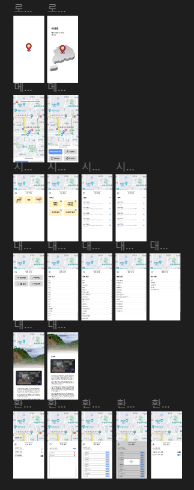

# 240304 월

> ### 오늘 한일
>
> - 지도 맵 이미지 저장(naver map 크롤링)
> - 이미지 전처리 코딩
> - 문서작업(wireframe)

> ### 오늘 배운 것
>
> - 리액트 네이티브 추가 학습
>   - 저장소 사용 방법
>   - 컴포넌트 구성 방법
> - 개발자 도구를 활용한 이미지 크롤링 방법

> ### 발전 과제
>
> - 지도 데이터 효율적인 저장 방법
> - 경로 알고리즘 학습
> - 리액트 네이티브 심화

# 240305 화

> ### 오늘 한일
>
> - 지도 맵 이미지 저장 테스트
> - 이미지 전처리 예외 케이스 추가
> - 문서작업(wireframe) 마무리
> - 

> ### 오늘 배운 것
>
> - 리액트 네이티브 추가 학습
>   - 클론 코딩

> ### 발전 과제
>
> - 지도 데이터 관련 법률 확인
> - 리액트 네이티브 심화, 실습
> - 데이터 분산 처리 과정 학습
